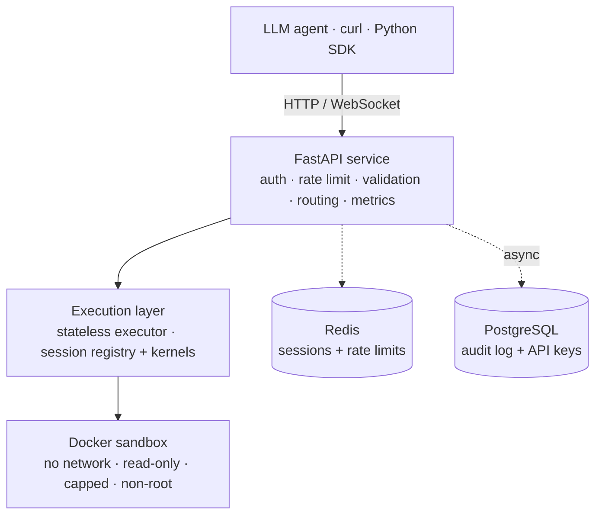

# Kestrel

[](https://github.com/Khan-Easa/kestrel/actions/workflows/ci.yml)
[](LICENSE)
[](.python-version)

**A secure, containerized Python code execution service for LLM agents** — safe
enough to run untrusted code, fast enough for real-time agent workflows, simple
enough to self-host.

LLM agents increasingly need to execute code as part of their reasoning. Calling
`subprocess` directly is insecure; running a full Jupyter stack is heavy; the
commercial sandboxes are expensive or not self-hostable. Kestrel is the middle
ground: send Python over HTTP, it runs in an isolated, network-less,
resource-capped Docker container, and you get back structured output — including
plots, DataFrames, and files. Sessions keep state across calls like a Jupyter
kernel.

## Features

- **REST API** for executing Python, with **bearer-token auth** and **per-key rate limits**.
- **Docker isolation** — every execution runs in a throwaway container: no network, read-only rootfs, capped memory/CPU/PIDs, non-root, dropped capabilities, seccomp.
- **Sessions** — a persistent REPL kernel per session; variables survive across executes.
- **Rich outputs** — matplotlib plots (base64 PNG), pandas DataFrames (JSON), and files, with per-output and per-execute size caps.
- **Streaming** — real-time stdout/stderr over WebSocket, with an HTTP long-poll fallback.
- **Observability** — Prometheus `/metrics`, request-ID tracing, and a PostgreSQL audit log of every execution.
- **Management** — an operator CLI (`kestrel-keys`) and admin endpoints for keys, sessions, and audit.
- **Self-hostable** — one `docker compose up` brings up the whole stack.
- **Python SDK** — sync + async clients ([`kestrel-client`](clients/python)).

## Architecture



Full design — layered structure, request-flow diagrams, and the decision index —
is in [`docs/architecture.md`](docs/architecture.md). The threat model is in
[`SECURITY.md`](SECURITY.md).

## Quickstart

Kestrel runs as a Docker Compose stack (API + Redis + PostgreSQL). You need Docker
with the daemon running.

```bash
# 1. Build the sandbox runtime image (once) — the API launches it on the host daemon.
docker build -t kestrel-runtime:0.5.0 docker/executor/

# 2. Bring up the stack.
docker compose up -d --build

# 3. Mint an API key (auth is on by default).
docker compose exec api kestrel-keys create my-key --scope admin
#   → prints a token like kestrel_xxxxx — copy it now (it is never recoverable).
```

Then call it:

```bash
curl -X POST http://localhost:8000/execute \
  -H "Authorization: Bearer kestrel_xxxxx" \
  -H "Content-Type: application/json" \
  -d '{"code": "print(2 + 2)"}'
```

```json
{ "stdout": "4\n", "stderr": "", "exit_code": 0, "duration_ms": 42,
  "timed_out": false, "stdout_truncated": false, "stderr_truncated": false }
```

Interactive API docs are served at `http://localhost:8000/docs` (Swagger) and `/redoc`.
Self-hosting details (production config, scaling, the docker-out-of-docker model)
are in [`docs/deployment.md`](docs/deployment.md).

> **Developing Kestrel itself?** Run the API directly with
> `uv sync --extra dev && uv run uvicorn kestrel.app:create_app --factory --reload`.
> With `KESTREL_DEV_API_KEY` unset, auth is disabled; the default Docker executor
> needs the runtime image built (step 1), or set `KESTREL_EXECUTOR_BACKEND=subprocess`
> for an unsandboxed local-only runner.

## Using the Python SDK

```bash
pip install kestrel-client
```

```python
from kestrel_client import KestrelClient

with KestrelClient("http://localhost:8000", api_key="kestrel_xxxxx") as kestrel:
    print(kestrel.execute("print(2 + 2)").stdout)        # "4\n"

    session = kestrel.create_session()
    kestrel.session_execute(session.session_id, "x = 41")
    print(kestrel.session_execute(session.session_id, "print(x + 1)").stdout)  # "42\n"

    for message in kestrel.stream(session.session_id, "for i in range(3): print(i)"):
        print(message)
```

An async client (`AsyncKestrelClient`, with WebSocket streaming) and runnable
LLM-agent integration examples (OpenAI, Anthropic, LangChain) are in
[`clients/python`](clients/python) and [`docs/examples`](docs/examples).

## Endpoints

| Method | Path | Auth | Purpose |
|---|---|---|---|
| `GET` | `/health` | open | Liveness probe. |
| `GET` | `/metrics` | open | Prometheus metrics. |
| `POST` | `/execute` | bearer | Run code in a one-shot sandbox. |
| `POST` | `/sessions` | bearer | Create a session. |
| `GET` | `/sessions` | bearer | List active sessions. |
| `GET` | `/sessions/{id}` | bearer | Session info. |
| `DELETE` | `/sessions/{id}` | bearer | Terminate a session. |
| `POST` | `/sessions/{id}/execute` | bearer | Run code in a session (rich outputs). |
| `WS` | `/sessions/{id}/execute/stream` | bearer | Stream a session execute. |
| `POST` | `/sessions/{id}/execute/polling` | bearer | Start an async (pollable) execute. |
| `GET` | `/sessions/{id}/executions/{eid}` | bearer | Poll execute output. |
| `GET`/`POST`/`DELETE` | `/admin/keys`… | admin scope | Manage API keys. |
| `GET` | `/admin/sessions`, `/admin/audit` | admin scope | Operator views. |

Every response carries an `X-Request-ID` header (echoed if supplied, else
generated). Full request/response schemas: [`docs/api.md`](docs/api.md).

## Configuration

All settings are environment variables prefixed `KESTREL_`; defaults live in
[`src/kestrel/config.py`](src/kestrel/config.py). The most common:

| Variable | Default | Purpose |
|---|---|---|
| `KESTREL_DEV_API_KEY` | `""` | Dev bearer token; empty disables the dev shim. |
| `KESTREL_EXECUTOR_BACKEND` | `docker` | `docker` or `subprocess`. |
| `KESTREL_EXECUTE_TIMEOUT_SECONDS` | `5.0` | Per-execute wall-clock kill. |
| `KESTREL_SESSION_BACKEND` | `memory` | `memory` or `redis`. |
| `KESTREL_AUDIT_BACKEND` | `null` | `null` or `postgres`. |
| `KESTREL_API_KEY_BACKEND` | `null` | `null` or `postgres`. |
| `KESTREL_DATABASE_URL` | `""` | Postgres URL (required for the `postgres` backends). |

The full table is in [`docs/deployment.md`](docs/deployment.md).

## Security

Kestrel runs untrusted code by design. Each execution is confined to a container
with **no network**, a **read-only root filesystem** (writes only to a small
tmpfs), **memory/CPU/PID limits**, a **non-root user**, **all Linux capabilities
dropped**, **`no-new-privileges`**, and a **seccomp** syscall filter; runaway code
is **SIGKILL**ed at the timeout and output is size-capped. The full threat model —
what Kestrel does and does not protect against — and the adversarial test suite
are documented in [`SECURITY.md`](SECURITY.md).

## Project status

All 8 phases of the [roadmap](ROADMAP.md) are implemented: Foundation → Docker
Execution → Security & Resource Limits → Sessions → Rich Outputs → Streaming →
Observability & Management → Polish & Ship. See [`CHANGELOG.md`](CHANGELOG.md) for
per-release notes.

## Documentation

- [`docs/architecture.md`](docs/architecture.md) — architecture and design.
- [`docs/api.md`](docs/api.md) — full API reference.
- [`docs/deployment.md`](docs/deployment.md) — self-hosting guide.
- [`SECURITY.md`](SECURITY.md) — threat model and controls.
- [`CONTRIBUTING.md`](CONTRIBUTING.md) — how to contribute.
- [`clients/python`](clients/python) — Python SDK.
- [`docs/examples`](docs/examples) — LLM-agent integration examples.

## Development

```bash
uv sync --extra dev          # set up the venv
uv run pytest -v             # run the test suite
```

Docker is required for the execution/isolation tests; Redis and PostgreSQL
containers are needed for the session-redis and audit/key tests (see
[`CONTRIBUTING.md`](CONTRIBUTING.md)).

## License

MIT — see [`LICENSE`](LICENSE).
