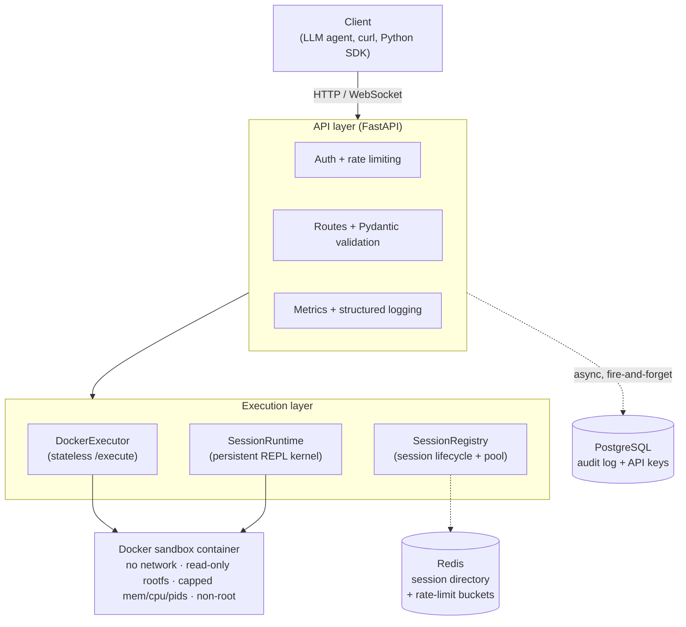
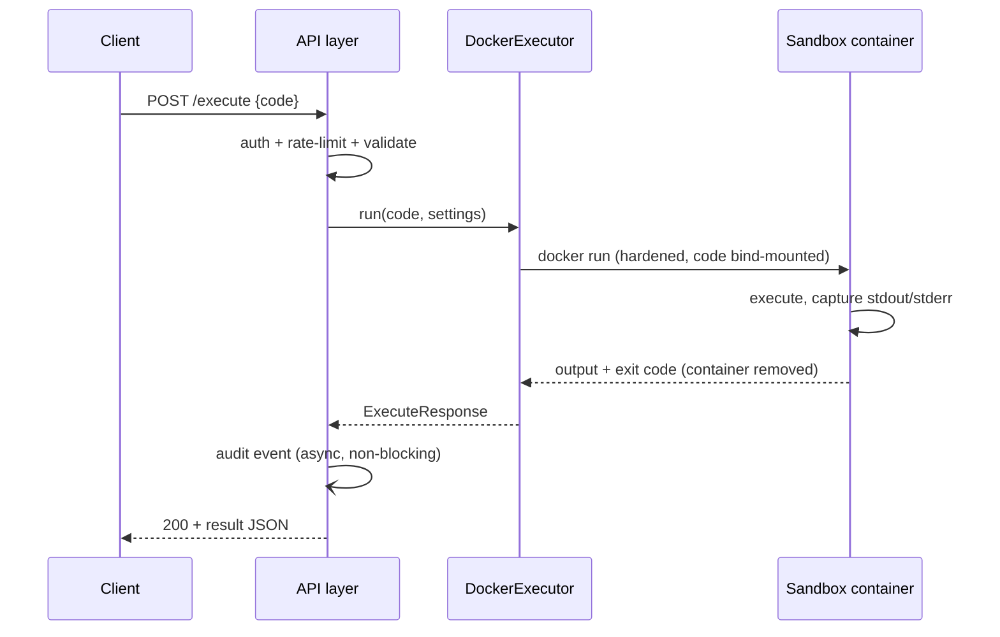
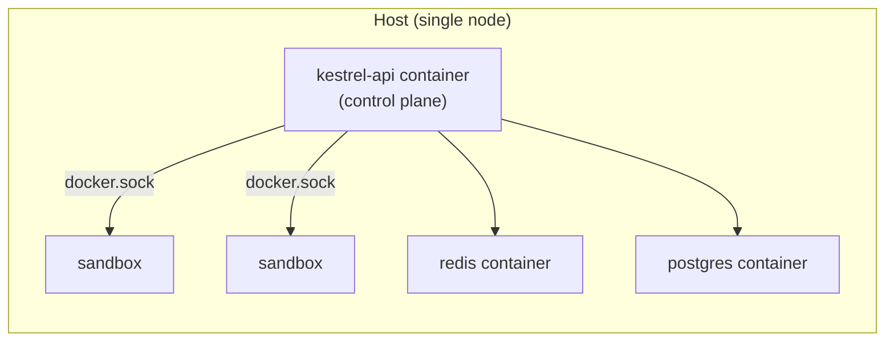

# Kestrel Architecture

This is the canonical architecture document for Kestrel. The root `DESIGN.md`
points here; per-decision rationale (with rejected alternatives) lives in
[`DECISIONS.md`](../DECISIONS.md); the threat model is in
[`SECURITY.md`](../SECURITY.md).

## What Kestrel is

Kestrel is a self-hosted service that runs **untrusted Python code** on behalf of
LLM agents and returns structured results. Clients send code over HTTP (or
WebSocket); Kestrel executes it inside an isolated, resource-capped, network-less
Docker container and returns captured stdout/stderr, rich outputs (plots,
DataFrames, files), and execution metadata. Sessions keep a Python process alive
across calls, like a Jupyter kernel.

## Layered design

Kestrel is a layered system. Each layer depends only on the ones below it through
narrow, swappable interfaces (Python `Protocol`s), which is what lets the backends
(executor, session registry, audit sink, key store, rate limiter) be reconfigured
by environment variable without touching the routes.

- **API layer** (`src/kestrel/app.py`, `src/kestrel/api/`) — FastAPI built via a
  `create_app()` factory. Owns authentication, per-key rate limiting, Pydantic
  request/response validation, routing, the request-ID middleware, Prometheus
  metrics, and structured logging. Holds no execution logic.
- **Execution layer** (`src/kestrel/execution/`) — turns a code string into a
  result. `DockerExecutor` runs the stateless `POST /execute` as a fresh
  one-shot container. `SessionRegistry` owns session lifecycle (create, list,
  terminate, idle-sweep, warm pool); `SessionRuntime` is the long-lived container
  with a persistent Python REPL kernel that sessions execute against.
- **Sandbox** (`docker/executor/`) — the `kestrel-runtime` image. Every container
  Kestrel launches applies the full hardening bundle (see SECURITY.md).
- **State** — Redis backs the session directory + rate-limit buckets when scaled
  to multiple workers; PostgreSQL backs the audit log and the API-key store.

## Request flow — stateless `POST /execute`

For session executes the flow is the same up to the API layer, but the code goes
to an already-running `SessionRuntime` (one container per session) over a
JSON-line protocol on the container's stdin/stdout, so variables persist. The
WebSocket and polling routes stream the kernel's output as it is produced.

## Key design decisions (index)

Full rationale in [`DECISIONS.md`](../DECISIONS.md). The load-bearing ones:

- **Docker over Firecracker/gVisor** — simpler, sufficient for the threat model.
- **One container per request (stateless) / per session (stateful)** — no
  cross-request state leakage; sessions amortise container start-up.
- **Code delivered as a read-only bind-mounted tempfile**, not stdin or `python -c`.
- **Killing `docker run` does not stop the container** — the executor `docker kill`s
  by name on timeout and the app sweeps orphans on startup.
- **JSON-line over stdin/stdout** for the session kernel protocol — not Jupyter/ZMQ.
- **Timeout is data, not an error** — a hung program returns `timed_out=true` with
  HTTP 200, never a 5xx.
- **Swappable backends via `Protocol`** — executor (`docker`/`subprocess`), session
  registry (`memory`/`redis`), audit sink (`null`/`postgres`), API-key store
  (`null`/`postgres`), rate limiter (memory/redis, following the session backend).
- **Audit is fire-and-forget** through a bounded queue — observability, not the
  system of record; overflow drops and bumps a counter.
- **The API is the trusted control plane** — in the containerised deployment it
  drives the host Docker daemon (docker-out-of-docker) to launch sandboxes; the
  sandboxes themselves never get the Docker socket.

## Deployment shape

The single-node deployment is a Docker Compose stack: the API container (mounting
the host Docker socket + a shared spool directory), Redis, and PostgreSQL. The API
is stateless and can scale horizontally; sandbox containers are pinned to their
sessions. See [`docs/deployment.md`](deployment.md).

## Where things live

| Concern | Module |
|---|---|
| App construction, lifespan, middleware | `src/kestrel/app.py` |
| Settings | `src/kestrel/config.py` |
| Routes | `src/kestrel/api/` |
| Stateless execution | `src/kestrel/execution/docker_executor.py` |
| Sessions | `src/kestrel/execution/session_*.py` |
| Sandbox image + kernel | `docker/executor/` |
| Audit log | `src/kestrel/audit.py`, `src/kestrel/db/` |
| API keys | `src/kestrel/api_keys.py` |
| Rate limiting | `src/kestrel/rate_limit.py` |
| Metrics | `src/kestrel/observability.py` |
| Operator CLI | `src/kestrel/cli/keys.py` (`kestrel-keys`) |
| Python SDK | `clients/python/` (`kestrel-client`) |
